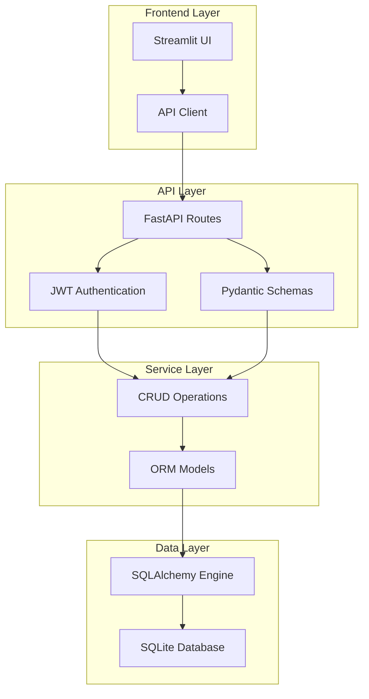
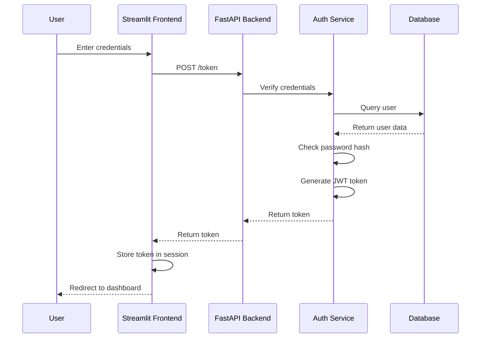
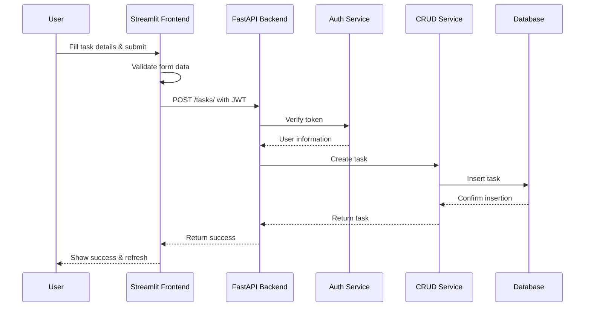
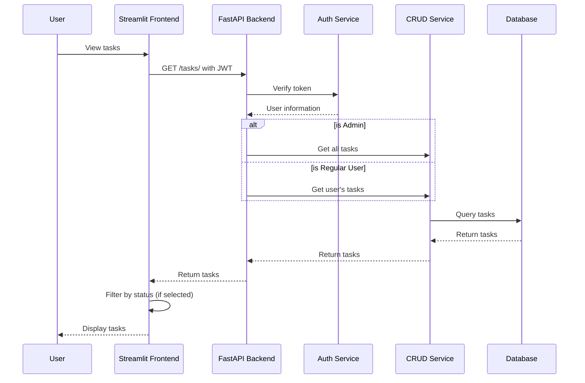
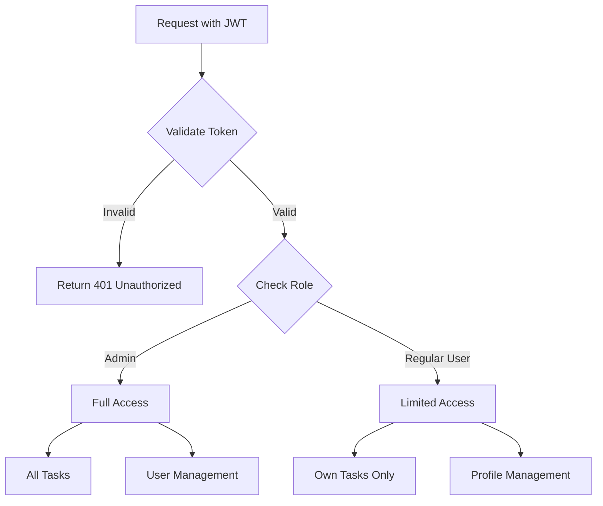
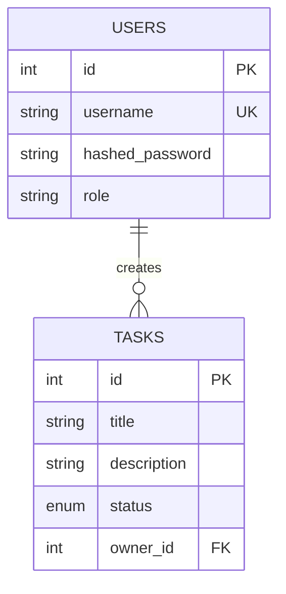
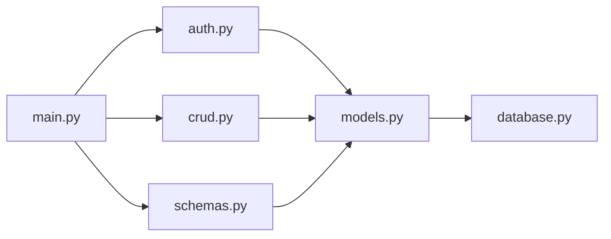

# Task Manager Application Architecture

This document provides a detailed overview of the application architecture and data flow.

## System Architecture

## User Authentication Flow

## Task Creation Flow

## Task Listing Flow

## Role-Based Access Control

## Database Schema

## Component Dependencies

## Data Flow Summary

1. **Authentication Flow**:
   - User logs in via Streamlit frontend
   - Credentials sent to FastAPI backend
   - Backend validates credentials and generates JWT token
   - Token returned to frontend and stored in session state
   - All subsequent requests include the JWT token

2. **Task Management Flow**:
   - Frontend sends requests with JWT token
   - Backend validates token and identifies user
   - Based on user role, appropriate access is granted
   - CRUD operations performed on the database
   - Results returned to frontend for display

3. **Role-Based Access**:
   - Admin users can access all tasks
   - Regular users can only access their own tasks
   - Permissions enforced at the API level