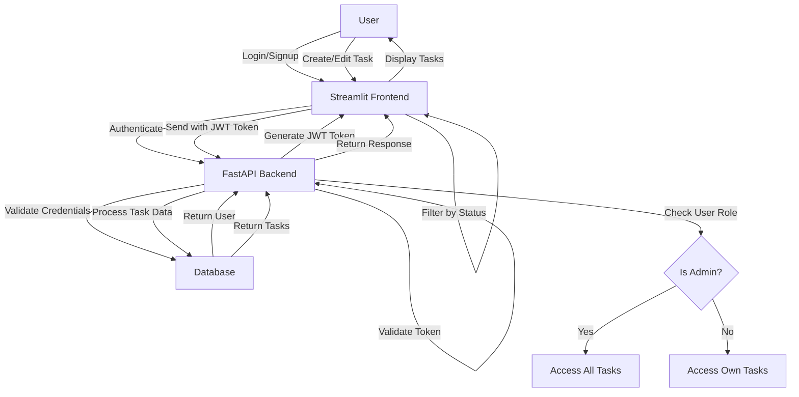

# Task Manager with FastAPI Authentication

A full-stack task management application with user authentication, built with FastAPI and Streamlit.

## 📋 Features

- **User Authentication**: Secure login/signup with JWT tokens
- **Task Management**: Create, read, update, and delete tasks
- **Role-Based Access**: Admin and regular user roles
- **Status Filtering**: Filter tasks by their status
- **Responsive UI**: Clean Streamlit frontend

## 🔧 Technology Stack

### Backend
- **FastAPI**: Modern, fast API framework
- **SQLAlchemy**: SQL toolkit and ORM
- **SQLite**: Lightweight database (easily upgradable to PostgreSQL)
- **JWT**: JSON Web Tokens for authentication
- **Pydantic**: Data validation and settings management

### Frontend
- **Streamlit**: Data app framework for creating the UI

## 📊 Application Flow Diagram



## 🚀 Getting Started

### Prerequisites

- Python 3.8+
- pip (Python package manager)

### Installation

1. Clone the repository:
   ```bash
   git clone https://github.com/yourusername/task-manager.git
   cd task-manager
   ```

2. Create and activate a virtual environment:
   ```bash
   python -m venv venv
   # On Windows:
   venv\Scripts\activate
   # On Unix/MacOS:
   source venv/bin/activate
   ```

3. Install dependencies:
   ```bash
   pip install -r requirements.txt
   ```

4. Fix any dependency issues (if needed):
   ```bash
   python fix_pydantic.py
   ```

### Running the Application

1. Start the FastAPI backend:
   ```bash
   python run_api.py
   ```
   The API will be available at http://127.0.0.1:8000
   
   API Documentation is available at:
   - Swagger UI: http://127.0.0.1:8000/docs
   - ReDoc: http://127.0.0.1:8000/redoc

2. In a new terminal, start the Streamlit frontend:
   ```bash
   streamlit run frontend/app.py
   ```
   The frontend will automatically open in your default web browser.

## 📁 Project Structure

```
task-manager/
├── backend/
│   ├── __init__.py
│   ├── main.py          # FastAPI application and routes
│   ├── models.py        # SQLAlchemy database models
│   ├── schemas.py       # Pydantic schemas for request/response
│   ├── database.py      # Database connection setup
│   ├── crud.py          # Database CRUD operations
│   ├── auth.py          # Authentication logic with JWT
│   └── utils.py         # Utility functions
├── frontend/
│   └── app.py           # Streamlit UI application
├── requirements.txt     # Project dependencies
├── fix_pydantic.py      # Script to fix dependency issues
├── run_api.py           # Helper script to run the FastAPI server
└── README.md            # Project documentation
```

## 🔐 API Endpoints

### Authentication
- `POST /token` - Login and get JWT token
- `POST /users/` - Register a new user
- `GET /users/me/` - Get current user information (requires authentication)

### Tasks
- `POST /tasks/` - Create a new task (requires authentication)
- `GET /tasks/` - Get all tasks (filtered by user role)
- `GET /tasks/{task_id}` - Get a specific task
- `PUT /tasks/{task_id}` - Update a task
- `DELETE /tasks/{task_id}` - Delete a task

## 🧪 Testing

You can test the API directly using the Swagger UI at http://127.0.0.1:8000/docs while the backend is running.

## 🛣️ Future Improvements

- Add task due dates and reminders
- Implement pagination for tasks list
- Create admin dashboard
- Add export to CSV feature
- Email notifications
- Migrate to PostgreSQL for production

## 📄 License

This project is licensed under the MIT License - see the LICENSE file for details.

## 🙏 Acknowledgments

- FastAPI Documentation
- Streamlit Documentation
- SQLAlchemy Documentation